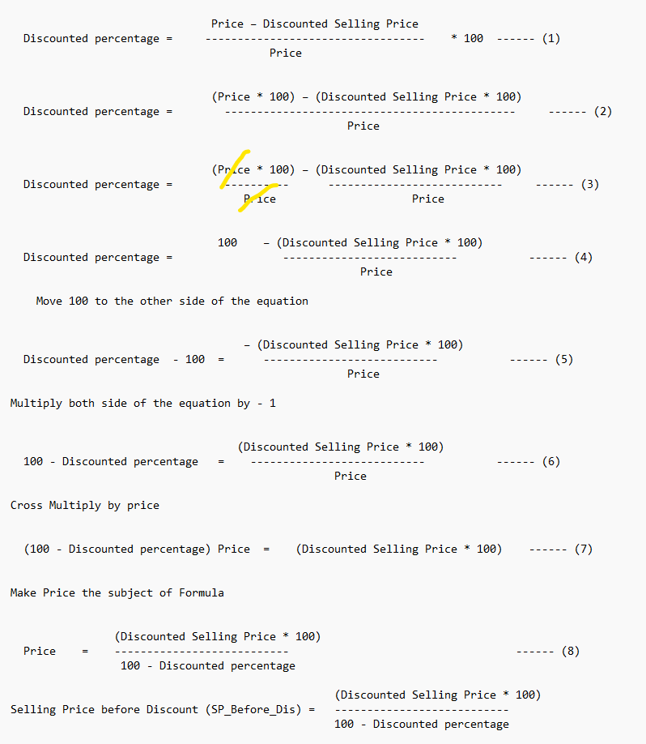

# Amazing Superstore Analysis

## Introduction

**Type of Data Set:**  Sales Dataset 

**Stakeholder Requirement / Problem Statement:** The analysis aims to identify areas where the company can improve its performance and productivity, also draw out insight for Improved Decision-Making, Sales and Profitability. 
1. Create a dashboard, do a Show and Tell at the end of the Sprint
2. Create a power point presentation to present the insight and recommendation.
3. Document the insights

**Data Structure:** There are 2 tables in the dataset, which are named <kbd> Listoforders </kbd> and <kbd> Orderbreakdown </kbd>.

**Relationship between the Stakeholder Requirement and the Dataset:** There is a strong relationship between the stakeholder requirement and the dataset considering column like Discount, sales, Profit and category. The dataset is super rich and it’s capable of providing relevant insights.

## Analysis Pipe Line

**Data Source:** SharePoint

**Data Transformation/Cleaning:** Data cleaning and transformation was carried out using Power Query. After scrutinizing all the columns, they were found to be valid and devoid of empty cells and errors. However, it was highly important that I transformed the Discount column to percentage for calculation purposes.

Hence new column and Tables were created, which are listed below
- A calendar table was created, this was achieved by using the <kbd> Min </kbd> and <kbd> Max </kbd> dax function on the <kbd> order date</kbd> from the <kbd>Orderbreakdown Table</kbd>.
- The <kbd>Month and Year columns </kbd> were also created on the <kbd>calendar table </kbd> which were extract of the <kbd>date column </kbd> on the <kbd>calendar table</kbd>.
- A new column was created for <kbd>Cost of Sale</kbd> on the <kbd>Orderbreakdown Table</kbd> by using the formula below
  
   Cost of Sales = Orderbreakdown[Sales] - Orderbreakdown[Profit]

   The formula above is simply “Cost of sales = Sales – profit”

   How the formula is derived is explained below
  
   Sales = Revenue

   Cost of Sales = Selling Price

   Profit = Revenue – Selling price

   **∴ Selling Price = Revenue - Profit**

- Another column is created named <kbd>SP_before_Dis</kbd> which stand for Selling Price Before Discount

   - The formula below is used if the <kbd>discount column</kbd> is in decimals
     
     SP_before_Dis = ( 1 * Orderbreakdown[Sales] ) / ( 1 - Orderbreakdown[Discount] )

   - This formula below is used if the <kbd>discount column</kbd> is in percentage 

     SP_before_Dis = (100 * Orderbreakdown[Sales] ) / ( 100 - Orderbreakdown[Discount] )
       
   The financial formula above shows the original selling price before discount is applied, let me break it down to show how we arrived at the above.
     
     

- A column was created for **profit without discount** (<kbd>Profit_B4_Dis </kbd>) been applied on the selling price, this column shows the profitability of the company without applying any discount on sales.

      Cost of sale is Unique and Universal
  
      Profit = Revenue - Selling Price without Discount
  
      Revenue is also knows as sales
  
      Selling Price is also known as cost of sales.
  
      Formula used is below
  
      <kbd> Profit_B4_Dis = Orderbreakdown[SP_before_Dis] - Orderbreakdown[Cost of Sales] </kbd>

 - A column named <kbd>Yes&No</kbd> was created, which state If Discount = 0 return No and If Discount > 0 is to return Yes
 - A Measure Table was created to house my Dax Functions

